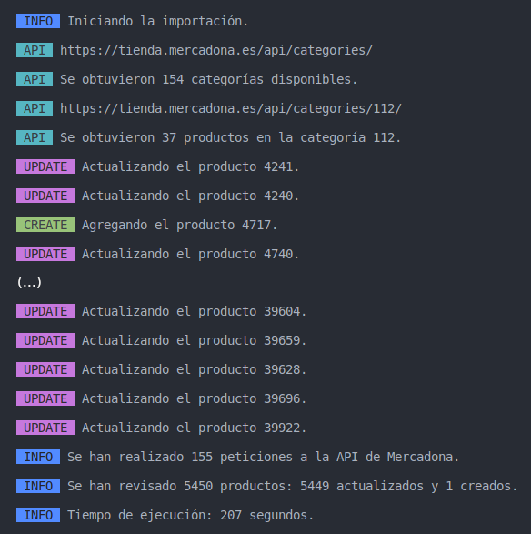
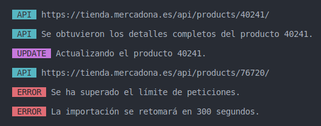

# PHP Mercadona Importer CLI

[](https://packagist.org/packages/josantonius/mercadona-importer)
[](LICENSE)
[](https://packagist.org/packages/josantonius/mercadona-importer)
[](https://github.com/josantonius/php-mercadona-importer/actions/workflows/ci.yml)
[](https://www.php-fig.org/psr/psr-1/)
[](https://www.php-fig.org/psr/psr-4/)
[](https://www.php-fig.org/psr/psr-12/)

Aplicación PHP de interfaz de línea de comandos (CLI) para importar productos de Mercadona utilizando su API.

---

- [Requerimientos](#requerimientos)
- [Instalación](#instalación)
- [Uso](#uso)
- [Configuración](#configuración)
- [Pruebas](#pruebas)
- [Tareas pendientes](#tareas-pendientes)
- [Registro de Cambios](#registro-de-cambios)
- [Contribuir](#contribuir)
- [Patrocinar](#patrocinar)
- [Licencia](#licencia)

---

## Requerimientos

- Sistema operativo: Linux.

- Versiones PHP: 8.1 | 8.2.

## Instalación

Clona el repositorio:

```console
git clone https://github.com/josantonius/php-mercadona-importer.git
```

Accede al repositorio clonado:

```console
cd php-mercadona-importer
```

Instala las dependencias:

```console
composer install
```

## Uso

Revisa la [configuración](#configuración) y ejecuta el script para iniciar la importación:

```console
php mercadona-importer.php
```



Para cada detalle del producto se utiliza la siguiente estructura:

```txt
mixed value
array previous
int   timestamp
```

De esta manera los datos no se sobrescriben al actualizar los productos, permitiendo mantener un
historial de cambios para cualquier detalle:

```jsonc
"unit_price": {
    "value": "7.90", // Valor actual
    "previous": [
        {
            "value": "7.40",  // Valor del día 20-01-2023
            "timestamp": 1674252044
        },
        {
            "value": "7.10",  // Valor del día 21-01-2023
            "timestamp": 1674338444
        }
    ],
    "timestamp": 1674511244 // 23-01-2023
}
```

[EJEMPLO DE PRODUCTO IMPORTADO](.github/docs/products/10379.json)

## Configuración

Puedes modificar las opciones de importación editando el archivo
[mercadona-importer.php](mercadona-importer.php) situado en la raíz del proyecto:

```php
new MercadonaImporter(
    warehouse: 'svq1',
    timezone: 'Europe/Madrid',
    delayForError: 300000000,
    delayForRequests: 1300000,
    includeFullProduct: false,
    reimportFullProduct: false,
    logDirectory: __DIR__ . '/logs/',
    outputDirectory: __DIR__ . '/products/',
);
```

### `warehouse`

```php
warehouse: 'svq1'
```

Mercadona muestra diferentes versiones de la tienda dependiendo de la ubicación de los usuarios.
Para ello asigna un almacén según el código postal desde el que se acceda.

Esto implica que, según el almacén desde el que se importe:

- El número de productos importados variará ya que dependerá de los que tengan habilitados.
- Un mismo producto puede tener diferentes detalles (peso, precio...) según la ubicación.

Algunos identificadores de centros logísticos que se utilizan son:

- `2343` - Murcia
- `2749` - Lleida
- `3532` - Valencia
- `3947` - Tarragona
- `3951` - Girona
- `3996` - Barcelona
- `4068` - Barcelona
- `4069` - Barcelona
- `4097` - Barcelona
- `4230` - Navarra
- `4267` - Álava
- `4354` - Almería
- `4385` - Castellón
- `4416` - Girona
- `4472` - Barcelona
- `4558` - Castellón
- `4697` - Álava
- `alc1` - Alicante y Murcia
- `bcn1` - Barcelona
- `mad1` - Madrid
- `svq1` - Sevilla, Cádiz y Huelva
- `vlc1` - Valencia

### `timezone`

```php
timezone: 'Europe/Madrid'
```

Se utiliza para la hora de los archivos de logs:

```txt
[2023-01-24T18:32:45.876599+01:00] LOG.INFO: Retomando la importación desde la categoría 163.
```

### `delayForError`

```php
delayForError: 300000000 // 300 segundos
```

Tiempo en microsegundos que se pausará la importación al recibir un error 429 por exceso de peticiones.



### `delayForRequests`

```php
delayForRequests: 1300000 // 1,3 segundos
```

Intervalo en microsegundos en el que se realizarán las peticiones a la API de Mercadona.

### `includeFullProduct`

```php
includeFullProduct: false
```

Al importar una categoría se obtienen todos los productos de ella, sin embargo los productos tienen
[detalles resumidos](.github/docs/products/category-product.json). Si se activa esta opción,
se importarán los [detalles completos](.github/docs/products/full-product.json) del producto en **una
sola ocasión** (al agregarlo por primera vez o si no se hizo en importaciones anteriores).

**IMPORTANTE** - Activar esta opción aumenta considerablemente el número de peticiones que se realizan
y el tiempo de ejecución, ya que si todos los productos son nuevos se realizará una petición por cada
uno de ellos:

- Importar con detalles resumidos: unas 150 peticiones y la importación dura unos 3-4 minutos.
- Importar con detalles completos: más de 5000 peticiones y la importación dura más de 5 horas.

### `reimportFullProduct`

```php
reimportFullProduct: false
```

Fuerza la importación de los detalles completos del producto aunque se hubiese hecho anteriormente.

**IMPORTANTE** - Las mismas consideraciones que con la opción `includeFullProduct`.

### `logDirectory`

```php
logDirectory: __DIR__ . '/logs/'
```

Directorio donde se guardarán los logs.

### `outputDirectory`

```php
outputDirectory: __DIR__ . '/data/'
```

Directorio donde se guardarán los archivos importados.

Los productos se almacenan en formato JSON utilizando el ID del producto como nombre y se organizan
por carpetas según el almacén que se utilice al importarlos:

`/data/svq1/39922.json`

`/data/mad1/39922.json`

`/data/bcn1/39922.json`

También se genera el archivo `/data/product_mapping.json` que contiene el catálogo completo de
productos con información básica:

```json
{
    "id": "39922",
    "ean": "8480000399229",
    "name": "Zumo de manzana",
    "warehouses": ["svq1", "mad1", "bcn1"]
}
```

## Pruebas

Run code standard tests with [PHPCS](https://github.com/squizlabs/PHP_CodeSniffer):

```console
composer phpcs
```

Run [PHP Mess Detector](https://phpmd.org/) tests to detect inconsistencies in code style:

```console
composer phpmd
```

Run all previous tests:

```console
composer tests
```

## Tareas pendientes

- [ ] Refactorizar la clase `MercadonaImporter`
- [ ] Desarrollar pruebas unitarias y funcionales
- [ ] Documentar métodos

## Registro de Cambios

Los cambios detallados de cada versión se documentan en las
[notas de la misma](https://github.com/josantonius/php-mercadona-api/releases).

## Contribuir

Por favor, asegúrate de leer la [guía de contribución](.github/CONTRIBUTING.md), antes de hacer un
pull request, comenzar una discusión o reportar un issue.

¡Gracias por [colaborar](https://github.com/josantonius/php-mercadona-api/graphs/contributors)! :heart:

## Patrocinar

Si este proyecto te ayuda a reducir el tiempo de desarrollo,
[puedes patrocinarme](https://github.com/josantonius#sponsor) para apoyar mi trabajo :blush:

## Licencia

Este repositorio tiene una licencia [MIT License](LICENSE).

Copyright © 2023-present, [Josantonius](https://github.com/josantonius#contact)
